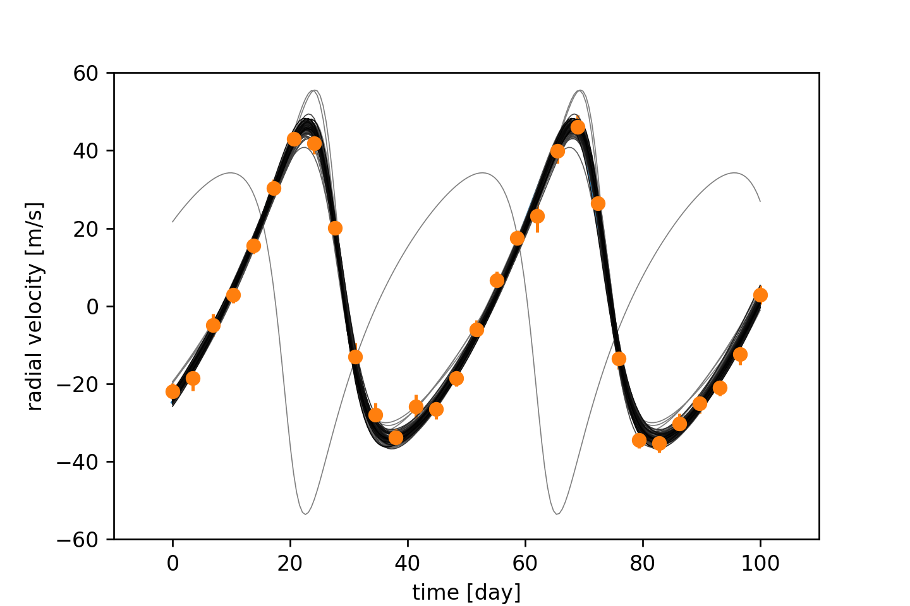
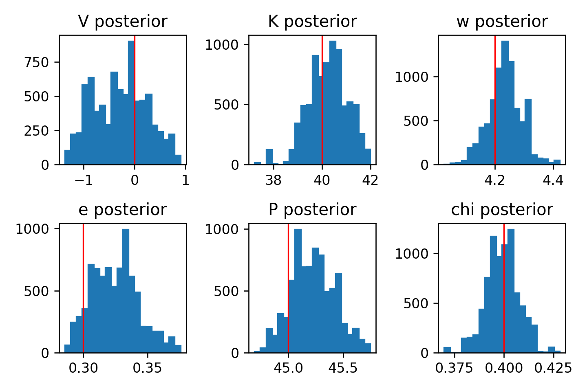

# mcmc-python
MCMC Parameter Fitting

## Create Your Own Metropolis-Hastings Markov Chain Monte Carlo Algorithm for Bayesian Inference (With Python)

### Philip Mocz (2023) [@PMocz](https://twitter.com/PMocz)

### 📝 [Read the Algorithm Write-up on Medium](https://levelup.gitconnected.com/create-your-own-metropolis-hastings-markov-chain-monte-carlo-algorithm-for-bayesian-inference-with-fbabc3f01baa)

Apply Markov Chain Monte Carlo to fit exoplanet radial velocity data and
estimate the posterior distribution of the model parameters


```
python mcmc.py
```




